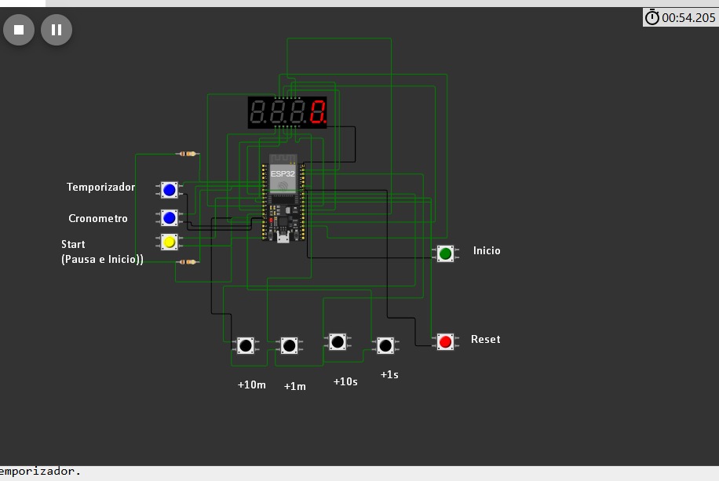

# ESP32_Timer_Stopwatch
 This project implements a timer and stopwatch using an ESP32 microcontroller. Simulated with Wokwi, it features a four-digit 7-segment display and push buttons for control. Ideal for timing tasks and countdowns.

## Files

- **`diagram.json`**: Contains the hardware configuration and connections.
- **`libraries.txt`**: Lists the required libraries for the project (if applicable).
- **`sketch.ino`**: Contains the source code.

## How to Use

1. **Upload Files to Wokwi**:
   - Go to [Wokwi](https://wokwi.com/) and create a new project.
   - Upload the files `diagram.json`, `libraries.txt`, and `sketch.ino` to your new Wokwi project.

2. **Start the Simulation**:
   - After uploading the files, click on the "Simulate" button to run your project.
   - You should see the ESP32 microcontroller and connected components working as per the code.

## Simulation

Simulate this project on Wokwi: [Wokwi Project Link](https://wokwi.com/projects/419214052478776321)


## Pins Configuration

### Buttons Pins:

- **Pin 5**: Reset button
- **Pin 18**: Start button
- **Pin 25**: Pause button
- **Pin 34**: Timer Mode button (Countdown)
- **Pin 35**: Stopwatch Mode button
- **Pin 19**: Increase 10 minutes
- **Pin 21**: Increase 1 minute
- **Pin 22**: Increase 10 seconds
- **Pin 12**: Increase 1 second

### 7-Segment Display Pins:

- **Digits**:
  - **Pin 27**: First digit
  - **Pin 23**: Second digit
  - **Pin 16**: Third digit
  - **Pin 17**: Fourth digit

- **Segments**:
  - **Pin 15**: Segment A
  - **Pin 4**: Segment B
  - **Pin 14**: Segment C
  - **Pin 33**: Segment D
  - **Pin 13**: Segment E
  - **Pin 2**: Segment F
  - **Pin 26**: Segment G
  - **Pin 32**: Decimal point (DP)

## Test Code for Timer and Stopwatch
Change 99 to the desired value for testing 


### Stopwatch: 

```cpp
elapsedTime = 99 * 60;

```

### Timer:
```cpp
remainingTime = 99 * 60;
```





Feel free to contribute and improve this project!

## Author

- **Jose Bustamante**

